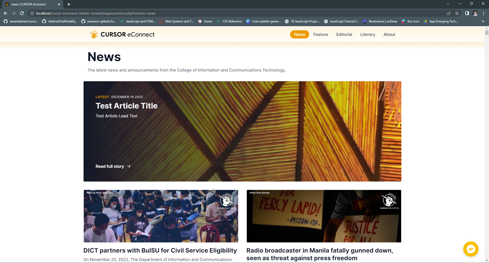
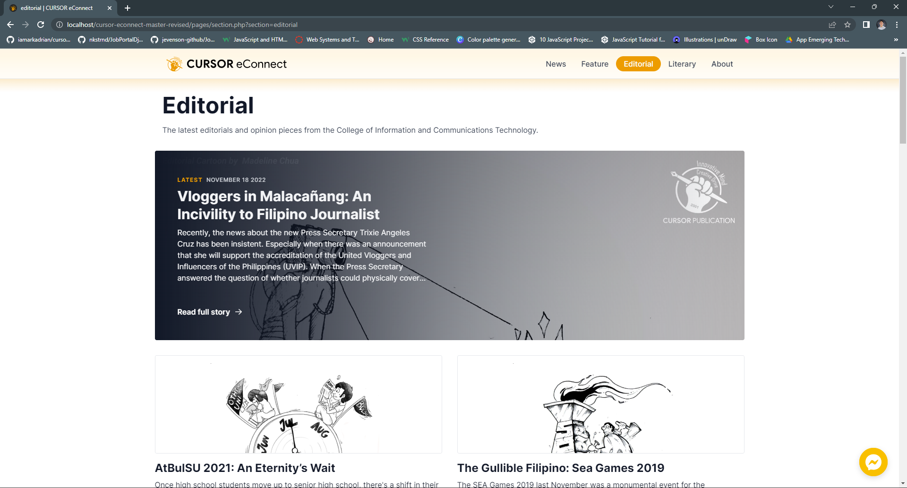
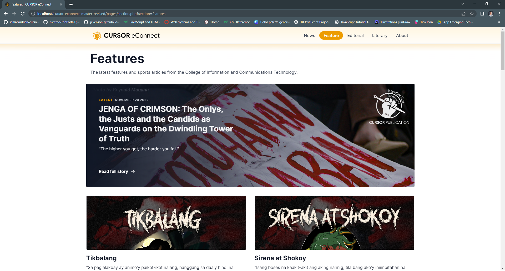
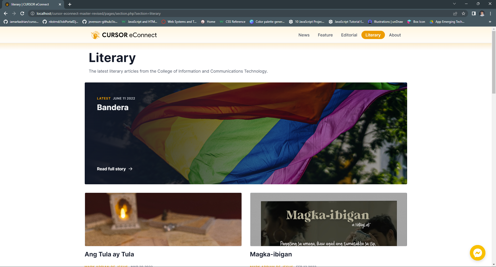
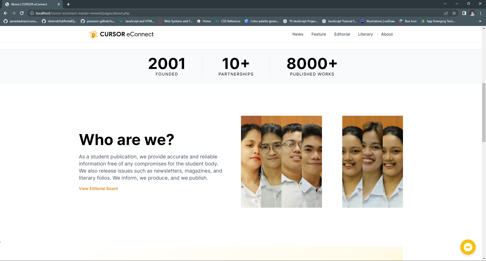

### A-Web-Based-CMS-and-News-Portal-for-Cursor-Publication-using-PHP-AJAX-and-Tailwind
A web-based student publication system for Bulacan State University College of Information and Communications Technology (BulSU-CICT). Through a series of pitching and formal interviews with the client, the project improved CURSOR Publication’s editorial process by reducing time spent on content entry, searching, and administration.

### Screenshots

#### Main Page : 

#### Editorial Page : 

#### Feature Page : 

#### Literary Page : 

#### About Page : 
